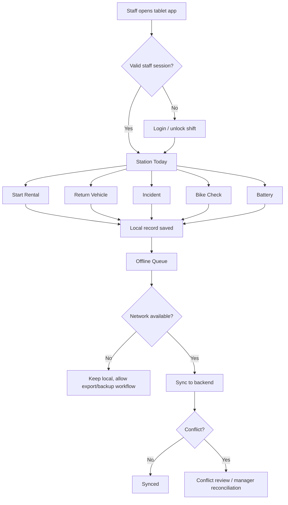
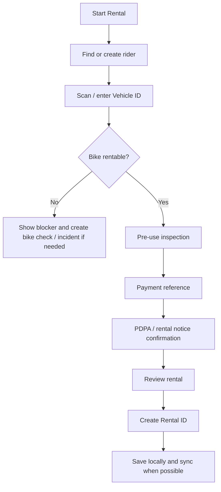
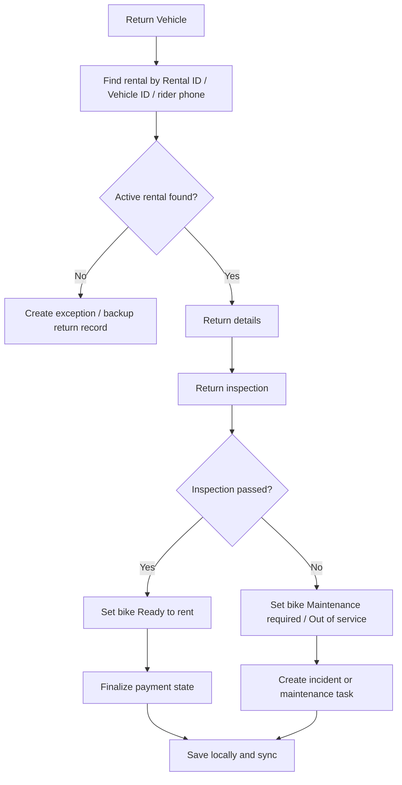

# Standalone Staff Tablet Wireflow And Offline Sync Spec

## Purpose

The staff tablet app is the station team's offline-first operating tool for MVP launch. It must let trained staff at Lamphun Tourism Center, Lamphun Railway Station, and the storage/operations center continue core service when internet or the main backend is unavailable.

The tablet app owns station execution:

- Staff-assisted rider registration.
- Rental start.
- Return and inspection.
- Payment reference capture.
- Incident and damage record.
- Bike check and status hold.
- Battery log and abnormal battery separation.
- Offline queue and sync recovery.
- Daily closeout handoff.

The admin web app owns management, reporting, reconciliation, and government visibility after records sync.

Companion documents:

- [Staff Tablet Low-Fidelity Wireframes](staff-tablet-low-fidelity-wireframes.md)
- [Staff Tablet Implementation Spec](staff-tablet-implementation-spec.md)

## Core Navigation

Use a persistent side rail or bottom rail sized for tablet use:

1. Station Today
2. Start Rental
3. Return Vehicle
4. Bike Check
5. Payment
6. Incident
7. Battery
8. Offline Queue
9. Daily Closeout
10. Help / SOP

Always show:

- Current station.
- Staff identity and role.
- Online/offline state.
- Unsynced record count.
- Backup mode indicator.
- Current shift date/time.

## Global Flow

## Screen Specs

### 1. Login / Unlock Shift

Goal: verify the trained staff member and establish station context.

Primary controls:

- Staff ID / email / PIN.
- Station selector for Lamphun Tourism Center, Railway Station, or storage/operations center.
- Shift start confirmation.
- Offline unlock for previously authenticated staff, if policy allows.

Required states:

- First online login.
- Offline re-auth for cached staff.
- Unauthorized staff.
- Station not assigned.
- Device clock mismatch warning.

Records created:

- `shift_session`
- Optional `staff_device_auth_event`

Design notes:

- Offline access should be time-limited and auditable.
- If staff cannot authenticate offline, route to manager backup procedure.

### 2. Station Today

Goal: give staff one operational home screen.

Sections:

- Active rentals.
- Returns due / overdue.
- Bikes ready to rent.
- Bikes blocked: pending inspection, charging, maintenance, out of service.
- Payments pending verification.
- Incidents open.
- Unsynced local records.
- Backup mode checklist.

Primary actions:

- Start rental.
- Return vehicle.
- Scan Vehicle ID.
- Record incident.
- Open offline queue.
- Start daily closeout.

Design notes:

- Use large status counts and short queue labels.
- Make unsafe/broken bikes visually distinct from ordinary unavailable bikes.
- The first screen should help staff answer: "Can I rent this bike now?"

### 3. Start Rental

Goal: create a valid rental start record with evidence, even offline.

Wireflow:

Required fields:

- Rental ID, generated before release.
- Station.
- Staff actor.
- Rider name.
- Rider phone.
- User type: local/citizen or tourist.
- Optional email.
- Optional ID/passport reference if policy requires it.
- PDPA/rental notice acceptance timestamp.
- Vehicle ID.
- Pre-use inspection result.
- Battery level or battery status.
- Payment method/reference or pending payment state.
- Photo evidence when required.

Bike blockers:

- Not found.
- Already in use.
- Reserved.
- Returned / pending inspection.
- Charging.
- Maintenance required.
- Out of service.
- Abnormal battery.
- Open incident hold.

Success state:

- Show Rental ID.
- Show Vehicle ID.
- Show return station options.
- Show payment status.
- Show sync state: synced or saved offline.
- Provide rider-facing confirmation view.

### 4. Rider Lookup / Staff-Assisted Registration

Goal: support riders without the mobile app when they are physically present at a station.

Entry points:

- Start Rental.
- Payment.
- Incident.

Search methods:

- Phone.
- Name.
- Existing membership/user ID.
- Manual new rider entry.

MVP minimal fields:

- Name.
- Phone.
- User type.
- PDPA/rental notice acceptance.
- Optional email.
- Optional ID/passport reference.

Design notes:

- Do not require app account creation to complete staff-assisted rental.
- Show "station-assisted rider" label for records created this way.
- Keep optional marketing/tourism consent separate from rental consent.

### 5. Pre-Use Inspection

Goal: prevent unsafe bike release.

Checklist:

- Brakes pass.
- Tires pass.
- Lights pass.
- Frame/handlebar/seat pass.
- Battery level/status acceptable.
- QR/Vehicle ID readable.
- No visible damage.
- No open maintenance/incident hold.
- Photo evidence captured if required.

Outcomes:

- Pass: continue to payment/review.
- Minor issue: block release or create maintenance note based on policy.
- Fail: set bike to maintenance required or out of service; create work order/incident.

Design notes:

- Keep this screen fast: large pass/fail toggles, optional notes only on fail.
- A failed critical item should immediately block the rental.

### 6. Payment Reference

Goal: capture enough payment information to reconcile revenue later.

Payment methods to support in UI until final payment policy is confirmed:

- PromptPay / Thai QR.
- Digital wallet.
- Credit card.
- Cash.
- Manual slip.
- Pending / staff exception.

Required fields:

- Rental ID.
- Amount or pricing plan.
- Payment method.
- Payment reference.
- Payment evidence image for manual slip.
- Verification state: pending, verified, rejected.
- Staff actor.

Offline behavior:

- Payment reference can be captured offline.
- Verification remains pending until sync or manager review.
- Missing payment should stay visible on Station Today and Daily Closeout.

### 7. Return Vehicle

Goal: close or hold a rental through inspection.

Wireflow:

Required fields:

- Rental ID.
- Vehicle ID.
- Return station.
- Staff actor.
- Return timestamp.
- Battery level/status.
- Distance/usage if available.
- Payment status.
- Return inspection result.
- Damage/incident flag.
- Photo evidence when required.

Return outcomes:

- Completed and ready.
- Completed, pending payment verification.
- Returned / pending inspection.
- Maintenance required.
- Out of service.
- Incident opened.
- Exception: return without matching start.

Design notes:

- Never silently mark a returned bike as rentable before inspection clears.
- If return is saved offline, show the bike as locally blocked on that tablet.

### 8. Return Inspection

Goal: decide whether the bike can re-enter service.

Checklist:

- Brakes pass.
- Tires pass.
- Lights pass.
- Frame/handlebar/seat pass.
- Battery normal.
- No new visible damage.
- Accessories present.
- Vehicle ID/QR still readable.
- Rider dispute or complaint recorded if applicable.

Fail actions:

- Create incident.
- Create maintenance work order.
- Mark bike maintenance required.
- Mark bike out of service.
- Capture photo evidence.

Design notes:

- Use the service script tone: explain to the rider that before/after condition evidence protects both sides.

### 9. Bike Check

Goal: inspect or update bike status outside a rental.

Use cases:

- Daily safety check.
- Bike found damaged.
- Bike returned to storage/operations center.
- Bike cleaned.
- Bike moved to charging.
- Bike released from maintenance after QC.

Fields:

- Vehicle ID.
- Current product status.
- Station/location.
- Checklist result.
- Notes.
- Photos.
- Staff actor.

Allowed status actions:

- Ready to rent.
- Returned / pending inspection.
- Charging.
- Maintenance required.
- Out of service.

Guardrails:

- Only technician or manager can clear maintenance required/out of service if policy requires it.
- QC status must be captured before returning from maintenance to ready.

### 10. Battery

Goal: provide launch-safe manual battery tracking before connected battery telemetry is reliable.

Use cases:

- Register Battery ID.
- Record battery level/status.
- Record battery swap.
- Record charge start/stop.
- Mark abnormal battery.
- Separate abnormal battery from service.
- Manual rotation note.

Fields:

- Battery ID.
- Vehicle ID if installed.
- Station.
- Charge level/status.
- Abnormal flag.
- Charger/slot if known.
- Staff actor.
- Timestamp.
- Notes/photo evidence.

Design notes:

- Abnormal battery should immediately block rental or require bike check.
- Real-time SOH, cycles, temperature, and telemetry can sync later when available.

### 11. Incident

Goal: capture operational issues with enough evidence to resolve and report.

Incident types:

- Accident.
- Damage.
- Breakdown.
- Lost bike.
- Battery issue.
- Payment dispute.
- Customer complaint.
- System/app issue.

Required fields:

- Incident type.
- Vehicle ID.
- Rental ID when known.
- Rider when known.
- Station.
- Description.
- Photo evidence.
- Staff actor.
- Resolution owner/status.

Outcome rules:

- Accident/damage/breakdown/battery issue should block bike rental.
- Payment dispute should keep payment verification pending.
- System/app issue should link to backup mode or offline record if relevant.

### 12. Manual Override

Goal: let trained staff keep service moving when normal app flow cannot complete.

Override reasons:

- Rider phone unavailable.
- Rider has no mobile app.
- Connectivity issue.
- Payment issue.
- System outage.
- Station exception.
- Emergency.
- Manager instruction.

Required fields:

- Reason.
- Staff actor.
- Station.
- Rental ID or Vehicle ID.
- Before/after bike status.
- Rider when known.
- Evidence/notes.

Guardrails:

- Public riders cannot trigger override.
- Override should appear in Daily Closeout and admin reconciliation.
- High-risk overrides should require manager approval once online.

### 13. Offline Queue

Goal: make local unsynced work visible and recoverable.

Queue groups:

- Rental starts.
- Returns.
- Rider registrations.
- Payment references.
- Incidents.
- Bike checks.
- Battery logs.
- Photos/evidence.

Record states:

| State | Meaning | Staff Action |
| --- | --- | --- |
| Draft | Incomplete local record | Finish or discard |
| Ready to sync | Required fields complete | Sync automatically when online |
| Syncing | Upload in progress | Wait; do not duplicate |
| Synced | Backend accepted record | No action |
| Needs evidence upload | Metadata synced but photo/evidence pending | Keep tablet online or retry |
| Conflict | Backend rejected or conflicting state found | Review, correct, or escalate |
| Exported to backup | Staff exported/entered record into Google Workflow | Keep until reconciliation confirms |
| Rejected | Manager/backend rejected record | Keep audit trail, do not delete silently |

Queue actions:

- Retry sync.
- Edit allowed fields before sync.
- Attach missing evidence.
- Export/share backup summary.
- Mark as entered in Google Workflow.
- Escalate to manager.

### 14. Daily Closeout

Goal: end the shift with a clean operational handoff.

Checklist:

- Active rentals still open.
- Returns completed.
- Bikes ready / blocked / maintenance / charging.
- Payments pending verification.
- Incidents opened and assigned.
- Battery abnormal flags.
- Unsynced local records.
- Backup records entered into Google Workflow.
- Shift handover note.

Outputs:

- Local closeout summary.
- Sync package status.
- Manager handoff report.
- Exception list.

Design notes:

- Staff should not be able to finish closeout while hidden unsynced critical records exist without acknowledging them.

### 15. Help / SOP

Goal: keep trained staff aligned under pressure.

Content:

- How to start rental.
- How to return bike.
- What to do when app/internet fails.
- Payment dispute script.
- Vehicle damage script.
- Accident/emergency steps.
- Battery abnormal handling.
- Contact manager/support.

Design notes:

- This is staff-facing and can be trained for MVP, but scripts shown to riders should be customer-ready.

## Offline Sync Spec

### Local Record Model

Every locally created record should include:

- `local_id`
- `record_type`
- `station_id`
- `staff_id`
- `device_id`
- `created_at_device`
- `updated_at_device`
- `business_id` when available, such as Rental ID or Vehicle ID
- `payload`
- `evidence_local_refs`
- `sync_state`
- `sync_attempt_count`
- `last_sync_attempt_at`
- `server_id`
- `conflict_reason`
- `manager_resolution`

### Record Types

| Record Type | Primary Business Key | Critical? |
| --- | --- | --- |
| `rider_registration` | phone or local rider ID | Yes when tied to rental |
| `rental_start` | Rental ID | Yes |
| `rental_return` | Rental ID | Yes |
| `payment_reference` | Payment ID or Rental ID | Yes |
| `incident` | Incident ID | Yes |
| `bike_check` | Vehicle ID + timestamp | Yes when failed |
| `battery_log` | Battery ID + timestamp | Yes when abnormal |
| `manual_override` | Rental ID or Vehicle ID + timestamp | Yes |
| `shift_closeout` | station + shift | Yes |
| `evidence_file` | local evidence ID | Yes when required by parent |

### Sync Priority

1. Staff/session validity and station config.
2. Rental starts.
3. Rental returns.
4. Payment references.
5. Incidents and manual overrides.
6. Bike checks and battery logs.
7. Evidence files.
8. Daily closeout.

Evidence can upload after metadata, but the parent record must show `Needs evidence upload` until required files are accepted.

### Sync Triggers

- App comes online.
- Staff taps retry.
- App foregrounds.
- Every fixed interval while online.
- Before daily closeout.
- Before staff logs out.

### Conflict Rules

| Conflict | Detection | Resolution |
| --- | --- | --- |
| Duplicate Rental ID | Server already has same Rental ID | Block duplicate; manager chooses canonical record |
| Bike already in use | Server bike status changed before sync | Keep local rental in conflict; manager resolves with audit note |
| Return without synced start | Return arrives before start | Hold return until start syncs or create exception |
| Payment mismatch | Amount/reference differs from server or duplicate reference | Send to payment reconciliation |
| Bike status stale | Local tablet thought bike was ready but server says blocked | Mark conflict and prevent further local rental for that bike after sync |
| Missing required evidence | Parent record requires photo/slip but file missing | Keep as Needs evidence upload |
| Staff not authorized | Staff role invalid at sync time | Escalate to manager; keep local audit trail |
| Device clock drift | Timestamp impossible or far from server time | Keep device timestamp and add server received timestamp; manager review if critical |

### Local Guardrails

- Do not delete synced or rejected critical records from the tablet without archival policy.
- Do not let staff create two active local rentals for the same Vehicle ID on the same tablet.
- Do not let a locally failed inspection be overwritten by a ready state without technician/manager permission.
- Block closeout unless unsynced critical records are synced, exported to backup, or acknowledged as exceptions.
- If storage is low, warn staff before evidence capture fails.

### Backup Export

When primary sync remains unavailable, staff should be able to export or manually transfer a backup package that mirrors Google Workflow fields:

- Start Rental records.
- Return Vehicle records.
- Incident records.
- Payment evidence references.
- Photo evidence list.
- Daily closeout summary.

The app should track `Exported to backup` separately from `Synced`. Exporting is not the same as backend acceptance.

## Acceptance Criteria

- Staff can start a rental while offline and receive a local Rental ID before releasing the bike.
- Staff can return a bike while offline and keep it blocked as pending inspection or maintenance required.
- Staff can register a no-mobile-app rider at a physical station.
- Staff can capture payment reference and slip evidence offline.
- Staff can create an incident offline and automatically block the bike when needed.
- Offline Queue clearly shows unsynced, syncing, synced, evidence-pending, conflict, and exported states.
- Daily Closeout exposes unresolved rentals, payments, incidents, blocked bikes, and unsynced records.
- When network returns, records sync in priority order and conflicts do not silently overwrite server state.
